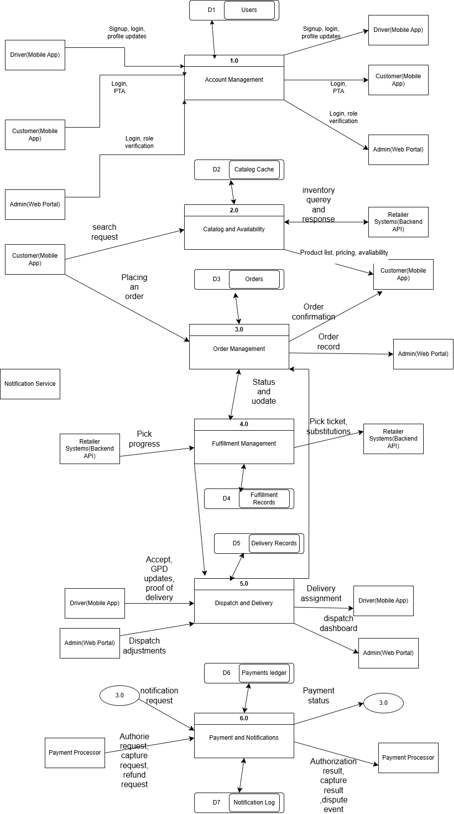
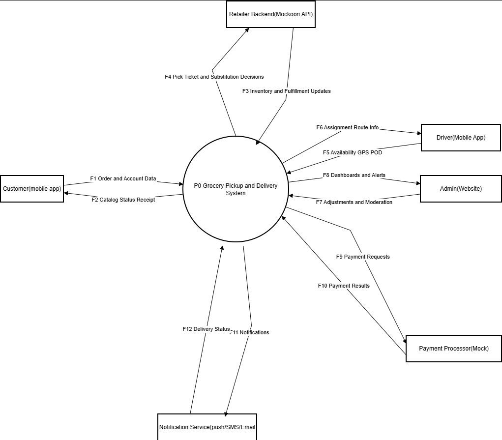
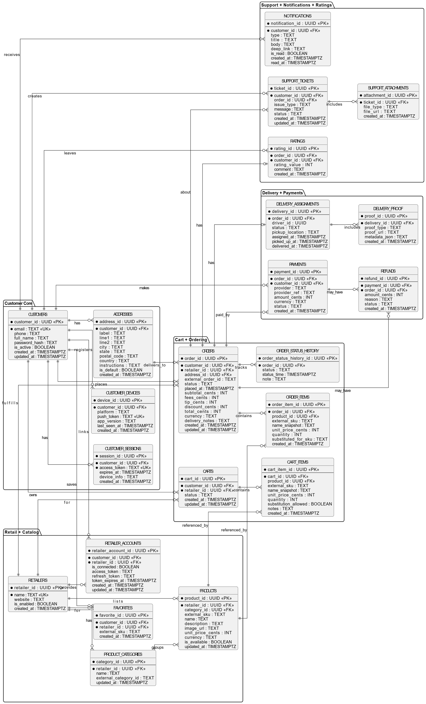
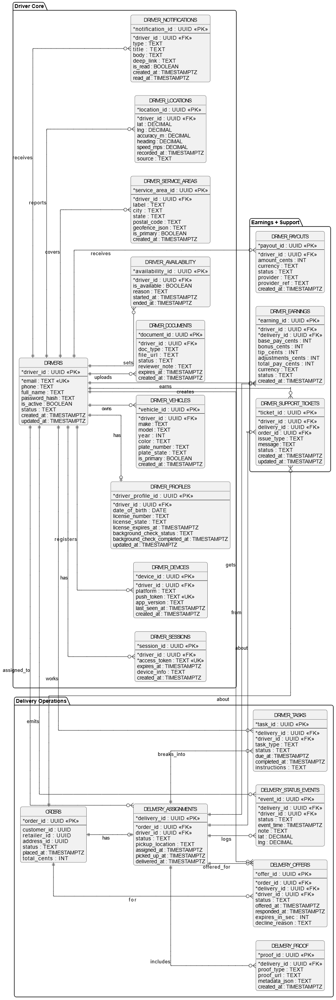
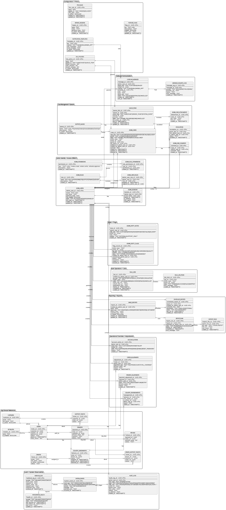

# CPS 491 - Capstone II (BizRush)

BizRush is a grocery pickup-to-delivery marketplace that connects customers, retailers, drivers, and administrators in one coordinated platform.

This README is the team-facing capstone project document for Spring 2026.

# Table of Contents

1. [Involved Parties](#parties)
   1. [CPS Department](#cps-department)
   2. [Student Team Members](#student-members)
   3. [Client Information](#client-info)
2. [Project Description](#project)
   1. [Project Overview](#project-overview)
   2. [Context and Scope](#project-context)
3. [System Analysis](#system-analysis)
   1. [Requirements](#requirements)
      1. [High-level Requirements](#high-level-requirements)
      2. [Low-level Requirements](#low-level-requirements)
   2. [Project Diagrams](#project-diagrams)
      1. [Architecture Diagram](#architecture-diagrams)
      2. [Sequence Diagrams](#sequence-diagrams)
      3. [Data Flow Diagrams](#dfd-diagrams)
   3. [Use Case Diagrams](#use-case-diagrams)
      1. [Use Case Descriptions](#use-case-descriptions)
4. [Technologies](#technologies)
   1. [Tech Stack](#tech-stack)
      1. [Flutter and Dart](#tech-a)
      2. [Backend API](#tech-b)
      3. [Admin Dashboard](#tech-c)
      4. [Infrastructure and Data](#tech-d)
   2. [Database Design](#db-design)
      1. [Initial Schema](#db-schema)
5. [Project Management](#project-management)
   1. [Planned Sprint Cycles](#sprint-cycles)
   2. [Team Meeting Schedule](#team-meeting)
   3. [Software Process Management](#software-process-management)
   4. [Project Timeline](#project-timeline)
   5. [Tasks and Commits Timeline](#tasks-commits-timeline)
   6. [Revision History](#revision-history)
6. [Runtime Instructions](#runtime-instructions)
7. [User Guide/Demo](#user-guide)
8. [Links to External Knowledge Base](#knowledge-base)

# Parties Involved <a name="parties"></a>

This is a joint project between the BizRush capstone team and the University of Dayton Department of Computer Science during the Spring 2026 semester.

## CPS Department Information <a name="cps-department"></a>

University of Dayton  
[Department of Computer Science](https://udayton.edu/artssciences/academics/computerscience/index.php)  
CPS 491 - Spring 2026

- Dr. Nick Stiffler

## Team Members <a name="student-members"></a>

1. Alex Testa, testaa2@udayton.edu
2. Bennett Moore, mooreb26@udayton.edu
3. Tidiane Dia, Diat01@udayton.edu

## Client Information <a name="client-info"></a>

Shelley Mayo-Mitchell

# Project: BizRush <a name="project"></a>

## Project Overview <a name="project-overview"></a>

BizRush is a pickup-to-delivery grocery marketplace proof of concept. Customers shop from retailer catalogs, place pickup-based orders, and track delivery; drivers accept jobs and complete delivery workflows; admins monitor and control operations.

## Project Context and Scope <a name="project-context"></a>

BizRush is designed as an orchestration layer between:

- Customer mobile experiences
- Driver mobile experiences
- Retailer systems (simulated with Mockoon in MVP)
- Admin operations and support workflows

For the capstone MVP, the system supports end-to-end order flow using mock retailer integrations and emphasizes architecture, lifecycle tracking, dispatch logic, and operations tooling.

Primary source: [Scope of Work](./specs/scope-of-work.md)

# System Analysis <a name="system-analysis"></a>

## Requirements <a name="requirements"></a>

### High-level Requirements <a name="high-level-requirements"></a>

- Customers can browse retailer products, build carts, place pickup-based orders, and track status.
- Drivers can authenticate, view available deliveries, accept jobs, confirm pickup, and complete delivery with proof.
- Admin users can monitor orders, update statuses, issue mock refunds, and observe driver activity.
- The backend can create and track order lifecycle events and integrate with mocked retailer endpoints.
- The platform can run customer app, driver app, backend API, mock services, and admin dashboard in a local development environment.

### Low-level Requirements <a name="low-level-requirements"></a>

- Customer API flows include `/products`, `/connect-retailer`, `/orders`, `/orders/{orderId}/status`, and `/support/tickets`.
- Driver API flows include `/auth/driver/login`, `/deliveries/available`, `/deliveries/{deliveryId}/accept`, `/deliveries/{deliveryId}/pickup`, and `/deliveries/{deliveryId}/complete`.
- Admin API flows include `/admin/orders`, `/admin/orders/{orderId}/status`, `/admin/orders/{orderId}/refund`, and `/admin/drivers`.
- System handles API timeout/error states with user-visible recovery paths.
- Mockoon-based POC behavior is deterministic enough for demo and testing.

Source: [Use Case Descriptions](./specs/use-cases/descriptions.md)

## Project Diagrams <a name="project-diagrams"></a>

### Architecture Diagram <a name="architecture-diagrams"></a>

BizRush follows a multi-application architecture with shared services:

- Customer and driver apps built in Flutter.
- Admin dashboard built for web operations.
- API and mock services running in a Docker-backed local environment.
- PostgreSQL-backed data services with supporting schema and seed workflows.



### Sequence Diagrams <a name="sequence-diagrams"></a>

- System sequence diagrams: [specs/use-cases/system-sequence-diagrams.md](./specs/use-cases/system-sequence-diagrams.md)
- Detailed sequence diagrams: [specs/use-cases/detailed-sequence-diagrams.md](./specs/use-cases/detailed-sequence-diagrams.md)
- Activity diagrams: [specs/use-cases/activity-diagrams.md](./specs/use-cases/activity-diagrams.md)

### Data Flow Diagrams <a name="dfd-diagrams"></a>

- DFD documentation: [specs/dfd/dfd.md](./specs/dfd/dfd.md)
- Context DFD:



## Use Case Diagrams <a name="use-case-diagrams"></a>

### Customer


### Driver


### Admin


### Use Case Descriptions <a name="use-case-descriptions"></a>

Detailed customer, driver, and admin use cases are documented here:  
[specs/use-cases/descriptions.md](./specs/use-cases/descriptions.md)

# Technologies <a name="technologies"></a>

## Tech Stack <a name="tech-stack"></a>

### Flutter and Dart <a name="tech-a"></a>

- Flutter apps:
  - Customer app: `apps/main`
  - Driver app: `apps/driver`
  - Shared package: `apps/shared`
- SDK target: Dart `>=3.4.1 <4.0.0`

### Backend API <a name="tech-b"></a>

- Node.js (engine `>=22`)
- TypeScript
- Express
- Kysely
- Zod
- Vitest and ESLint for quality checks

### Admin Dashboard <a name="tech-c"></a>

- Next.js
- React
- Tailwind CSS

### Infrastructure and Data <a name="tech-d"></a>

- Docker Compose orchestration
- PostgreSQL
- Flyway migrations (db module)
- Mockoon-style mock API stack under `mocks`
- `just` task runner for local developer workflows

## Database Design <a name="db-design"></a>

### Initial Schema <a name="db-schema"></a>

BizRush database design is split by domain view:

- Customer domain ER model: [specs/er-diagrams/customer.md](./specs/er-diagrams/customer.md)
- Driver domain ER model: [specs/er-diagrams/driver.md](./specs/er-diagrams/driver.md)
- Admin domain ER model: [specs/er-diagrams/admin.md](./specs/er-diagrams/admin.md)

Representative diagrams:







# Project Management <a name="project-management"></a>

## Planned Sprint Cycles <a name="sprint-cycles"></a>

- Sprint 0: Discovery and architecture alignment
- Sprint 1: Core customer, driver, and admin flows
- Sprint 2: Integration hardening, reliability, and demo readiness

## Team Meeting Schedule <a name="team-meeting"></a>

- Team sync cadence: TBD (pending confirmation)
- Client sync cadence: TBD (pending confirmation)

## Software Process Management <a name="software-process-management"></a>

- Repo-managed workflows with `just` recipes for setup, run, test, check, format, and build.
- Multi-component quality checks:
  - `just test`
  - `just check`
  - `just format`
- Local orchestration:
  - `just run` (backend stack)
  - `just run main-web`
  - `just run driver-web`
  - `just run admin`

## Project Timeline <a name="project-timeline"></a>

| Phase | Target Window | Focus |
| ----- | :-----------: | ----: |
| Discovery | Spring 2026 (early) | Requirements, architecture, and modeling |
| MVP Development | Spring 2026 (mid) | Customer/driver/admin core workflows |
| Hardening | Spring 2026 (late) | Reliability, observability, and demo polish |

## Tasks and Commits Timeline <a name="tasks-commits-timeline"></a>

The following weekly timeline follows the same per-person format used in `Weekly-Checkin-Presentation-Template.pdf` and maps to repository commit activity.

| Week (2026) | Alex Testa (Tasks from Weekly Check-in) | Bennett Moore (Tasks from Weekly Check-in) | Tidiane Dia (Tasks from Weekly Check-in) | Commits (Alex / Bennett / Tidiane) |
| ---------- | :-------------------------------------- | :----------------------------------------- | :---------------------------------------- | ----------------------------------: |
| Feb 08 - Feb 14 (Week 2) | Created scope-of-work foundation and learned Flutter. | Created Flutter app, set up repos/Jira, and prepared Docker/framework work. | Tested Flutter on Mac and started website work (Astro/Starlight). | 2 / 23 / 0 |
| Mar 01 - Mar 07 (Week 5) | Finished DFD suite (Context/Diagram 0/Child diagrams). | Containerized admin dashboard, created Walmart/Target mocks, reviewed architecture docs. | Designed UI for both apps and planned driver map UI next. | 6 / 24 / 3 |
| Mar 08 - Mar 14 (Week 6) | Built SQL tables, used Flyway, and ran DB in Docker. | Reduced duplicate Flutter code with shared package and built backend API base. | Added UI for driver app map. | 2 / 16 / 3 |
| Mar 22 - Apr 04 (Week 8) | Automated SQL seed data and adjusted seed depth. | Connected backend API to mobile apps, integrated CI workflows, worked integration bugs/UX. | Connected API client to admin/backend; worked Mapbox and address editing/deleting UI. | 3 / 47 / 3 |
| Apr 05 - Apr 11 (Week 9) | Added SQLfluff linting and planned public website/testing next. | Focused on integration/CI code review and deployment/localhost passthrough planning. | Driver refresh offers, address CRUD in main app, and customer order cancellation. | 0 / 8 / 0 |

Example commits linked to these weekly efforts:

- Alex Testa: `Create SOW.md`, `added DFD, Diagram 0, Child Diagrams`, `[feat] added sqlfluff linting`.
- Bennett Moore: `feat: create new structure with two sibling apps [BR-20]`, `Add reusable Flutter API client package`, `ci: add db.check workflow`.
- Tidiane Dia (`Tidiane12275` in git history): `Add driver/customer home UIs and app themes`, `Add Mapbox route map & navigation for driver`, `Add admin UI, auth, and admin API ops`.

Note: Commit counts above were derived from `git log` date windows and include merge commits.

## Revision History <a name="revision-history"></a>

| Date       | Version | Description |
| ---------- | :-----: | ----------: |
| 2026/04/24 |   0.3   | Added weekly tasks/commits timeline by team member |
| 2026/04/24 |   0.2   | BizRush-specific README rewrite from template |
| 2026/01/22 |   0.1   | Sprint 0 draft |
| 2026/01/08 |   0.0   | Initial draft |

# Runtime Instructions <a name="runtime-instructions"></a>

For local development:

1. Install prerequisites:
   - Flutter
   - Docker
   - npm/Node.js
   - `just`
2. Run one-time setup:

```bash
just setup
```

3. Start backend stack:

```bash
just run
```

4. Start customer web app:

```bash
just run main-web
```

5. Start driver web app:

```bash
just run driver-web
```

6. Start admin dashboard:

```bash
just run admin
```

Additional setup details: [DOCKER.md](./DOCKER.md)

# User Guide/Demo <a name="user-guide"></a>

Basic demo flow:

1. Customer browses mock products and places an order.
2. Admin views and updates order status to simulate fulfillment readiness.
3. Driver accepts delivery, confirms pickup, and completes delivery with proof.
4. Customer tracks order progression and can submit support requests.

See full scenario docs:

- [Use Case Descriptions](./specs/use-cases/descriptions.md)
- [System Sequence Diagrams](./specs/use-cases/system-sequence-diagrams.md)
- [Detailed Sequence Diagrams](./specs/use-cases/detailed-sequence-diagrams.md)
- [Activity Diagrams](./specs/use-cases/activity-diagrams.md)

# Knowledge Base <a name="knowledge-base"></a>

Core project knowledge sources in this repository:

- [Scope of Work](./specs/scope-of-work.md)
- [Data Flow Diagrams](./specs/dfd/dfd.md)
- [Use Cases](./specs/use-cases/descriptions.md)
- [ER Diagrams](./specs/er-diagrams/customer.md)

Note: If any section above needs additional client-approved specifics (meeting cadence, production URL, or final sprint dates), we can update it directly once confirmed.
