# Grocery Pickup-to-Delivery Marketplace App

## Activity Diagrams (Mockoon Proof of Concept)

---

# Table of Contents

1. Customer Activity Diagrams
   1.1 [C1 – Browse Mock Products and Build Cart](#c1--browse-mock-products-and-build-cart)
   1.2 [C2 – Simulate Retailer Account Linking](#c2--simulate-retailer-account-linking)
   1.3 [C3 – Place Mock Pickup Order](#c3--place-mock-pickup-order)
   1.4 [C4 – Track Simulated Order Status](#c4--track-simulated-order-status)
   1.5 [C5 – Submit Mock Support Requests](#c5--submit-mock-support-requests)

2. Driver Activity Diagrams
   2.1 [D1 – Driver Login](#d1--driver-login)
   2.2 [D2 – Fetch Available Mock Deliveries](#d2--fetch-available-mock-deliveries)
   2.3 [D3 – Accept Mock Delivery](#d3--accept-mock-delivery)
   2.4 [D4 – Confirm Pickup](#d4--confirm-pickup)
   2.5 [D5 – Complete Delivery with Proof (Photo)](#d5--complete-delivery-with-proof-photo)

3. Admin Activity Diagrams
   3.1 [A1 – View All Orders](#a1--view-all-orders)
   3.2 [A2 – Manually Update Order Status](#a2--manually-update-order-status)
   3.3 [A3 – Issue Mock Refund](#a3--issue-mock-refund)
   3.4 [A4 – View Drivers](#a4--view-drivers)
   3.5 [A5 – Simulate API Failure](#a5--simulate-api-failure)

---

# Customer Activity Diagrams

---

## C1 – Browse Mock Products and Build Cart

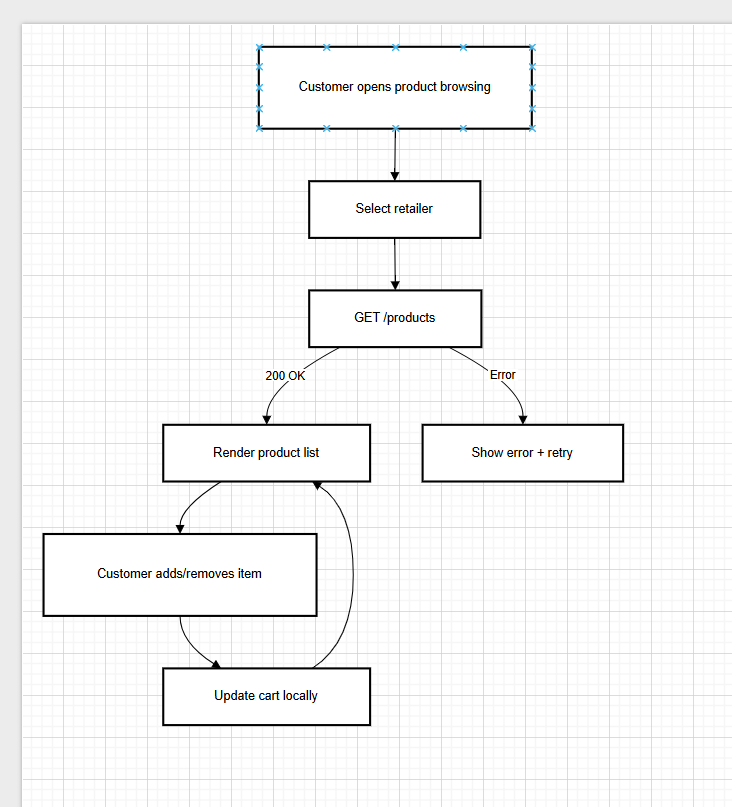

---

## C2 – Simulate Retailer Account Linking

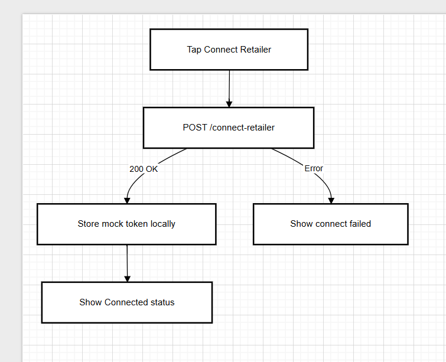

---

## C3 – Place Mock Pickup Order

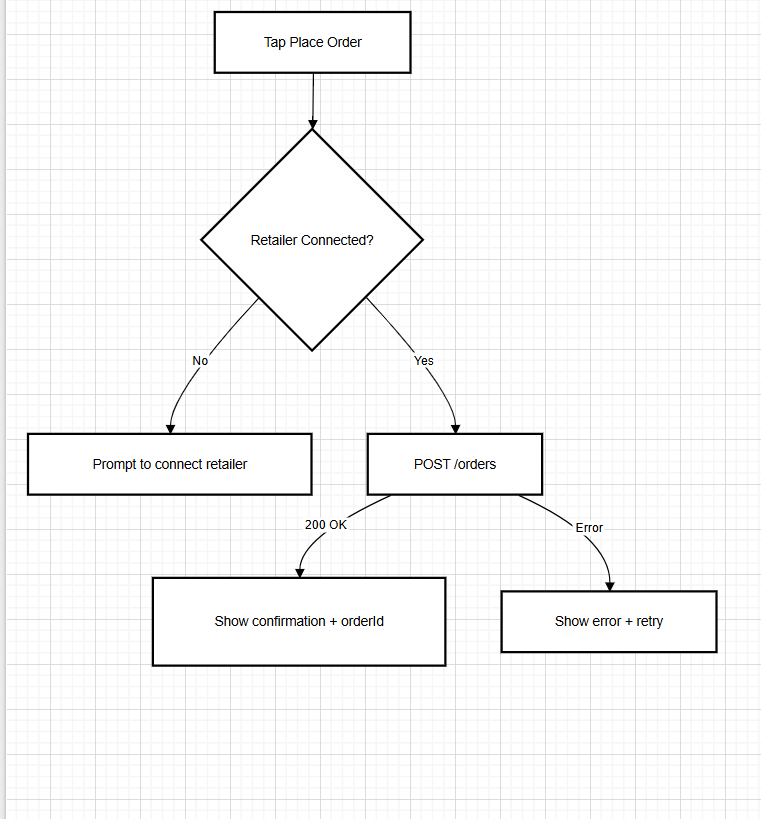

---

## C4 – Track Simulated Order Status

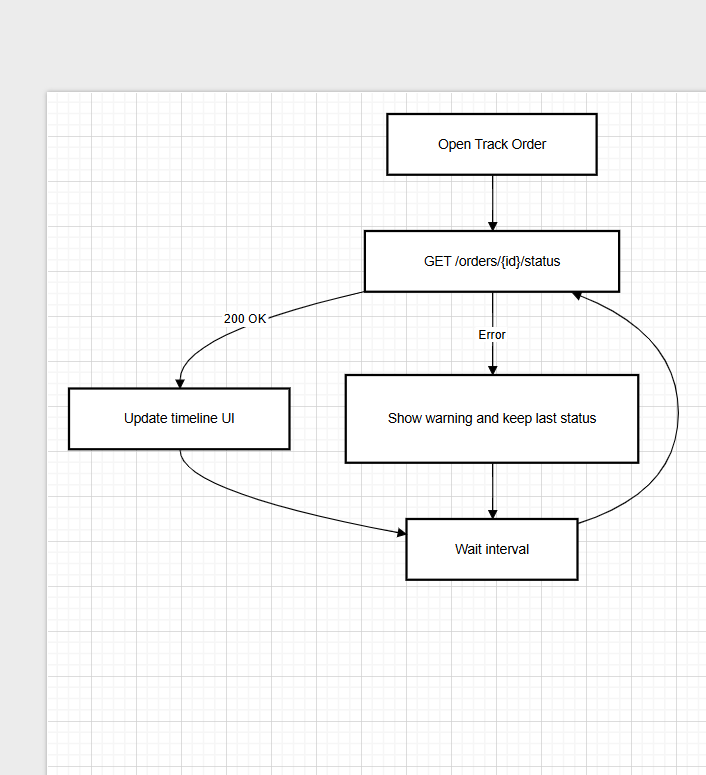

---

## C5 – Submit Mock Support Requests

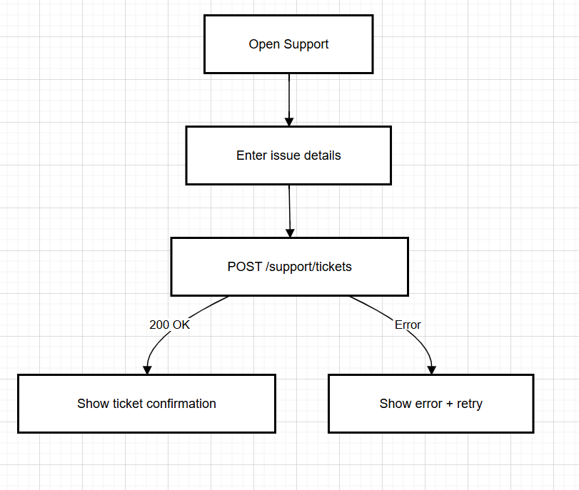

---

# Driver Activity Diagrams

---

## D1 – Driver Login

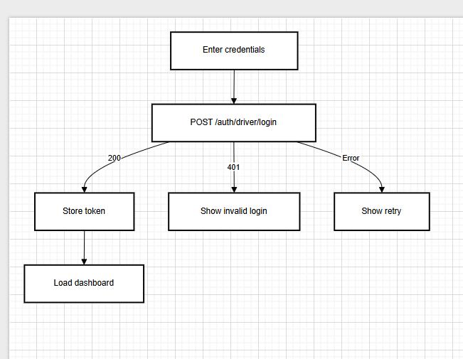

---

## D2 – Fetch Available Mock Deliveries

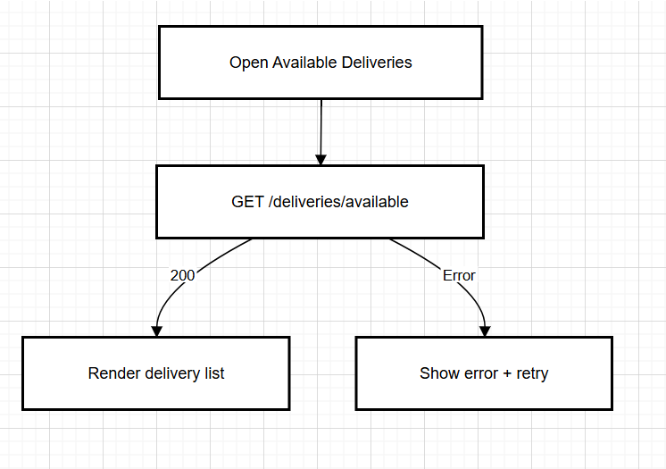

---

## D3 – Accept Mock Delivery

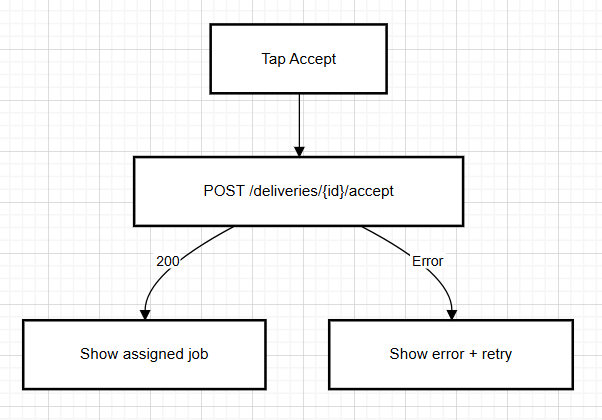

---

## D4 – Confirm Pickup

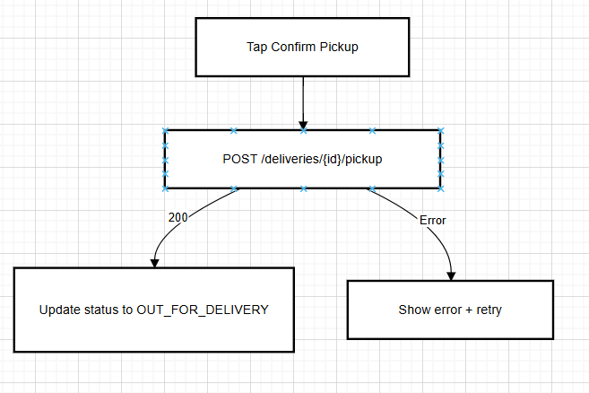

---

## D5 – Complete Delivery with Proof (Photo)

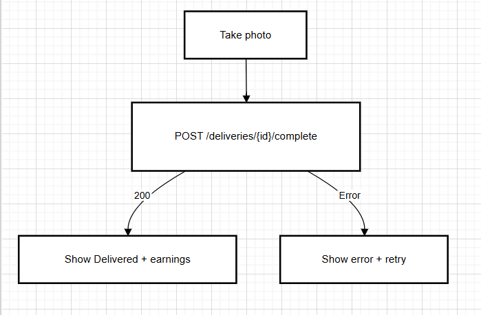

---

# Admin Activity Diagrams

---

## A1 – View All Orders

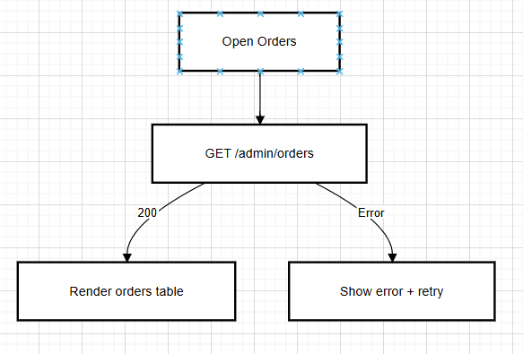

---

## A2 – Manually Update Order Status

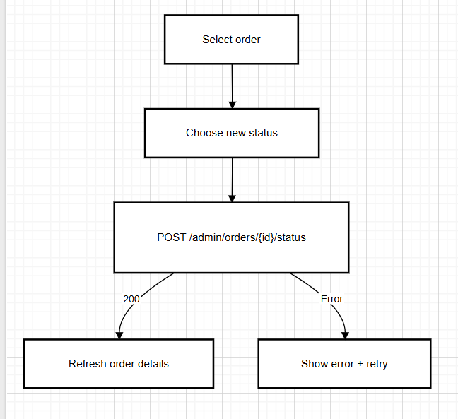

---

## A3 – Issue Mock Refund

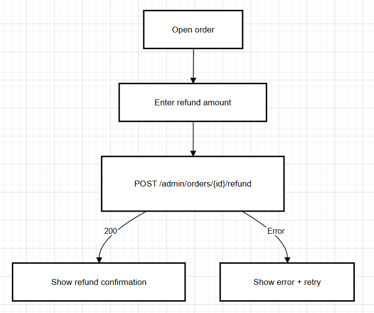

---

## A4 – View Drivers

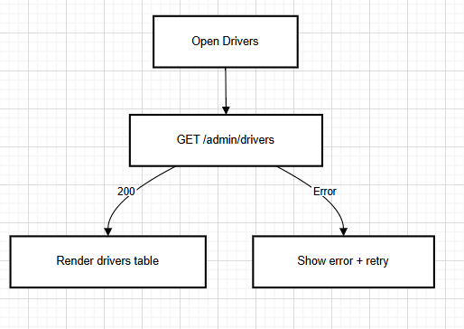

---

## A5 – Simulate API Failure

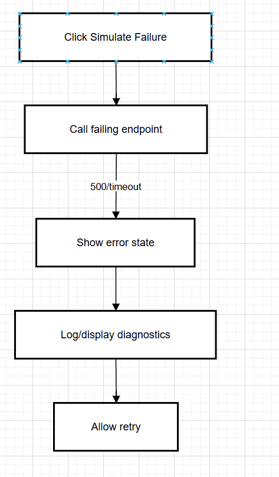

---
